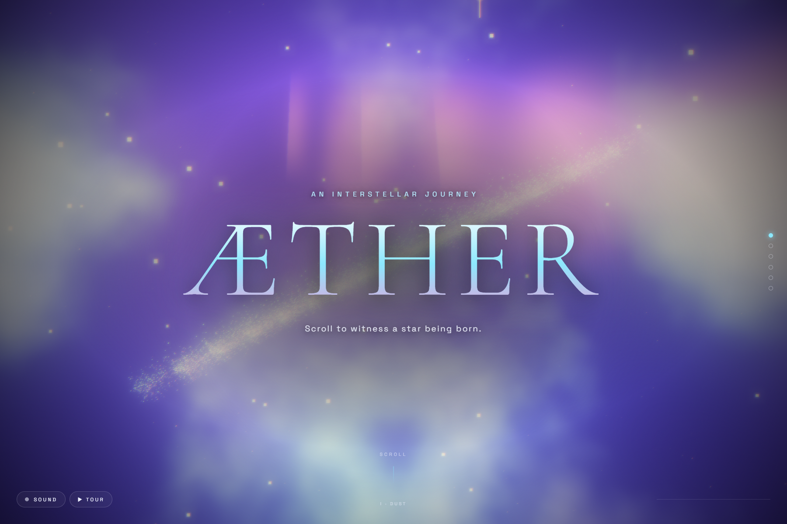
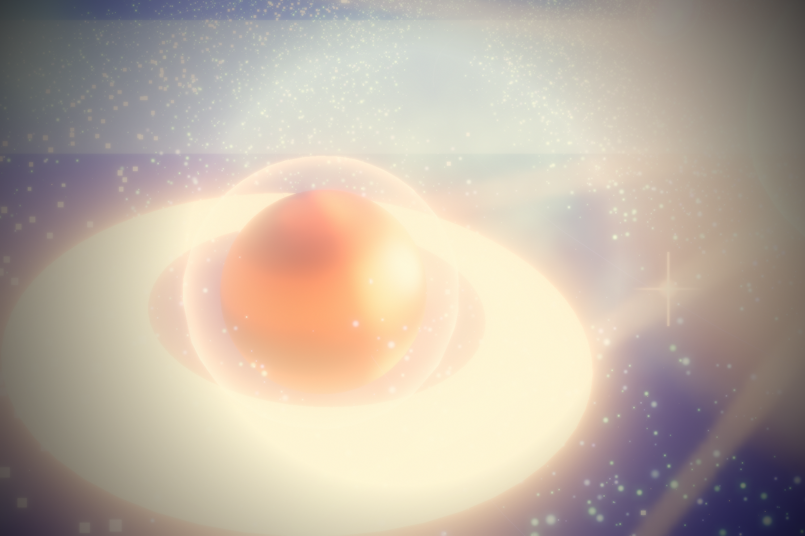
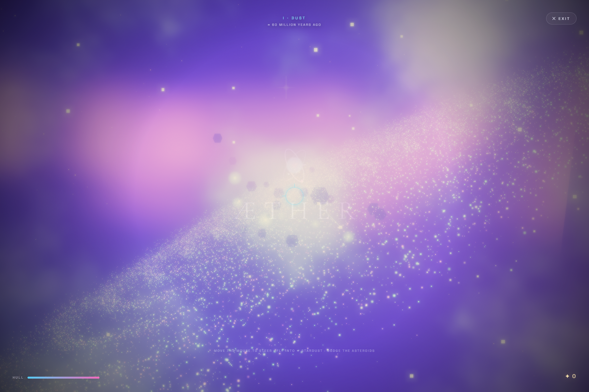

# ÆTHER — Birth of a Star

**🌐 Live demo: http://85.215.197.199:8477/**





**🎮 Also playable as a game** — press **🛸 PILOT** (or add `?pilot=1`): you're an alien pilot diving 60 million years into the past, flying through all four eras, collecting stardust and dodging asteroids. Boost, dash (i-frames), grab power-ups (repair / magnet / time-dilation), chain combos into **Overdrive**, survive era-specific hazards and a **supernova shockwave** — then post your run to the **online leaderboard**. Playable with mouse + keyboard **or** touch controls on phones.



An interactive 3D website built for the **3D Websites Hackathon**. Scroll and you travel
through the life of a star: a spiral galaxy of ~46,000 particles collapses into a glowing
core, erupts into a supernova, and finally settles into a living planetary system you can
explore — all in one continuous, cinematic shot.

> Most sites solve a problem. This one tries to make you say *"wow."*

## ✨ Highlights
- **46,000 GPU particles** morphing between **four** shapes (galaxy → collapsing core → supernova → protoplanetary disk) in a single custom GLSL shader.
- **Four acts in one continuous shot.** Scroll = time; the whole narrative is driven by scroll progress, smoothed for a filmic feel.
- **A newborn planetary system** — a glowing sun and four lit planets (one ringed) orbiting inside the settled disk.
- **Real postprocessing stack:** UnrealBloomPass + custom chromatic-aberration pass (flares on ignition/clicks) + ACES tone mapping + exposure pulse + fog + film grain + vignette.
- **Self-generated ambient sound** — a breathing synth drone built live in the Web Audio API; particles pulse to it. Clicking plays a pentatonic **chime**.
- **Interactive:** click/tap anywhere for a **shockwave** ripple; drifting nebulae; occasional shooting stars.
- **Cinematic fly-in** on load, keyframed camera choreography, mouse parallax, act indicator.
- **Zero build step.** Pure ES modules + Three.js from a CDN. Open the file, done.

## ⌨️ Controls
- **Scroll** — travel through the four acts.
- **Click / tap** — shockwave + chime.
- **SOUND** button — toggle the ambient drone.
- **▶ TOUR** button — auto-play the whole journey (~42s); perfect for recording the demo video.
- **↑ / ↓ / PageUp / PageDown / Space / Home / End** — jump between acts.
- **H** — photo mode: hide all UI for clean screenshots.

## 🛠 Tech
Three.js · WebGL · GLSL (custom vertex/fragment shaders) · EffectComposer / UnrealBloomPass · Web Audio API · vanilla JS/CSS.

## ▶️ Run locally
It must be served over HTTP (ES module imports don't work from `file://`):

```bash
# any static server works, e.g.
npx serve .
# or
python -m http.server 8000
```
Then open the printed URL and **scroll**. Click **SOUND** (bottom-left) for the full experience.

## 🚀 Deploy (for the public link requirement)
Drag the folder onto **Netlify Drop** (app.netlify.com/drop) or push to a repo and enable
**GitHub Pages** / **Vercel**. No configuration needed — it's fully static.

## 📁 Structure
```
index.html   — markup, import map, narrative overlay, HUD
styles.css   — cinematic overlay, loader, grain/vignette
main.js      — Three.js scene, particle shaders, bloom, audio, scroll logic
```

## 🎬 Submission checklist
- [x] Publicly accessible website link — *deploy per above*
- [x] Meaningful 3D / immersive visuals
- [x] Source code
- [ ] 3+ screenshots — capture the title, the collapsing core, and the supernova
- [ ] 1–5 min demo video — screen-record a slow scroll top-to-bottom with sound on

---
Built with Three.js. Assets are 100% procedural — nothing is downloaded, everything is math.
